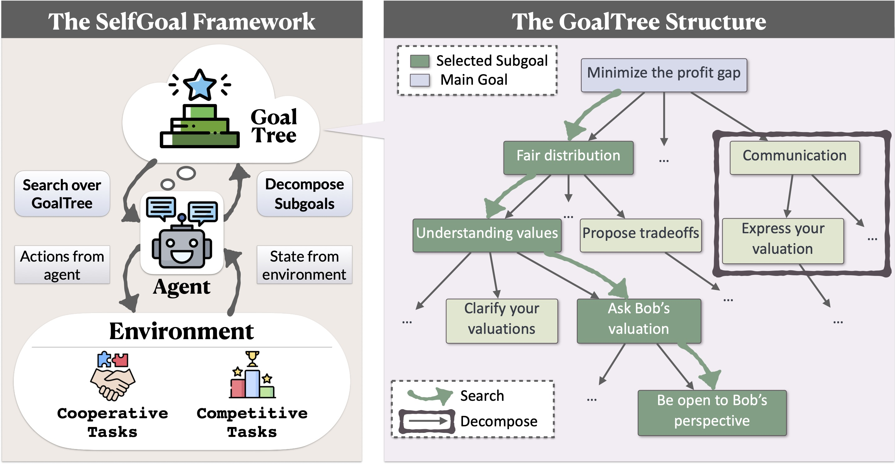

<p align="center">
     <br>
</p>
<h1 align="center">SELFGOAL: Your Language Agents
Already Know How to Achieve High-level Goals </h1>


<p align="center">
[<a href="https://goaltree.github.io/">Website</a>]
[<a href="https://arxiv.org/abs/2402.05733">Paper</a>] 

</p>


# SELFGOAL

SELFGOAL is a non-parametric learning algorithm for language agents, i.e., without parameter update. Concretely, SELFGOAL is featured with two key modules, Decomposition and Search which construct and utilize a subgoal tree respectively, namely GoalTree, to interact with the environment.

<p align="center">
     <br>
</p>

More details are in the paper.

## Setup Environment

Create a conda environment and install dependency:
```bash
conda create -n selfgoal python=3.11
conda activate selfgoal
pip install -r requirements.txt
```

Here we take ``AucArena`` as an example to illustrite Decompose and Search Module.
### Decompose Module

To adapt SELFGOAL to your current scenario, you have to describe your envrionment in ``prompt_base.py``

```bash
# main goal
Imagine you are an agent in a {scene}. 

Taking analogy from human behaviors, if your fundamental objective in this scenario is "{goal}", what sub-goals you might have?
```

### Search Module
At each stage, you also have to provide SELFGOAL with current state for Search Module to search most useful sub-goals

```bash
# Sub-Goal
Here's the current scenario:

{scene}

------------------------------
For the goal: "{sub_goal}", can you further run some deduction for fine-grained goals or brief guidelines?
```

## Run
#### For Open Source Models
For open source models, deploy the model as an API using <a href="https://docs.vllm.ai/en/latest/">vLLM</a>

```bash
python -m vllm.entrypoints.openai.api_server --model facebook/opt-125m --port 8001
```
## AucArena
```bash
python auction_workflow.py --shuffle --repeat 10 -t 4
```

## DealOrNotDeal
```bash
python gpt_bargain.py
```

## GAMABench
```bash
python guessing_game.py
python public_goods.py
```


## Example
The gernerated sub-goal will shown the same as in the following example:

```bash
Based on the current auction scenario, here are some derived sub-goals and detailed guidance to help you better achieve your primary objective, i.e., maximize your total profit: 
* Sub-goal: Market Value Research: Understand the current market value of the item being auctioned. This will help you estimate the potential profit and decide if the bidding price is justified.
* Sub-goal: Profit Margin Calculation: Calculate the potential profit margin based on the current bidding price and the market value of the item. This will help you understand if the cost of bidding is worth the potential benefit.

Please consider these sub-goals and detailed advice in your next round of strategic planning and action execution in the auction to help achieve your primary objective.
```


## Contact

If you have any problems, please contact [Ruihan Yang](mailto:rhyang17@fudan.edu.cn).

## Citation

If our paper or related resources prove valuable to your research, we kindly ask for citation. 

